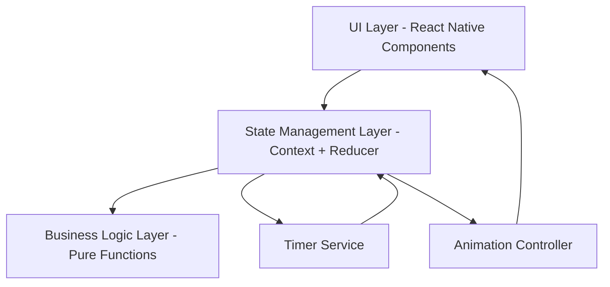
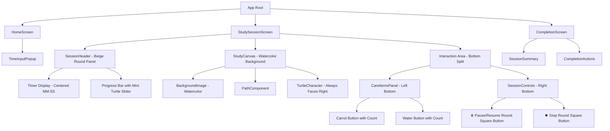
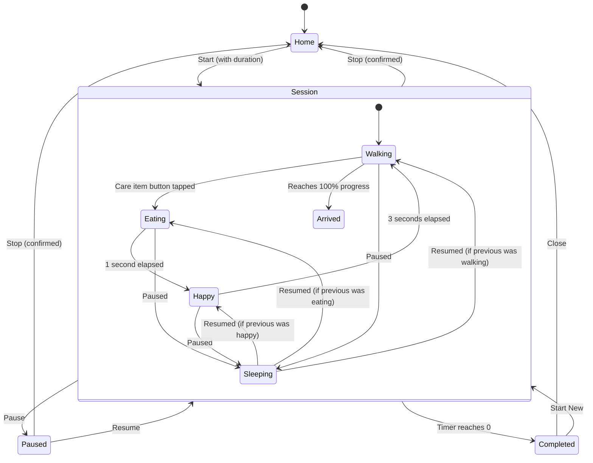

# Technical Design Document

## Recent Updates (Based on Final Requirements)

This design document has been updated to reflect the following key changes from requirements.md:

### UI Layout Changes:
- **SessionHeader**: Now a beige round panel with centered timer + progress bar featuring mini turtle icon slider
- **StudyCanvas**: Watercolor background with turtle always facing rightward
- **Interaction Area**: Split into left (CareItemsPanel with "돌봐주기" title) and right (SessionControls with ⏸️⏹️ round square buttons)

### Error Handling Updates:
- **REMOVED**: "잘못 클릭하셨어요" toast error message for non-interactive area touches
- **UPDATED**: Non-interactive area touches now completely ignored (no-op)
- **ADDED**: Shake animation for depleted item buttons (×0)

### Animation Specifications:
- **Turtle direction**: Always faces rightward (toward GOAL)
- **eating animation**: turtle_eating.jpeg with head nodding + mouth movement (1s)
- **happy animation**: turtle_happy.jpeg with heart effect above head (3s)
- **arrived state**: turtle_arrived.png with static positioning next to GOAL flag (NO bouncing)

### Edge Case Handling:
- **Timer completion during eating/happy**: Immediately clear all async intervals → transition to arrived state
- **Pause during eating/happy**: Store previous state + remaining duration for restoration on resume

---

## Overview

거북이 스터디 앱은 React Native 기반의 모바일 애플리케이션으로, 사용자가 공부할 때 함께 걷는 거북이를 통해 시간 관리와 동기 부여를 제공합니다. 앱의 핵심은 타이머 기반 진행 시스템, 거북이 캐릭터의 상태 관리, 그리고 사용자 인터랙션을 통한 격려 메커니즘입니다.

### Technology Stack

- **Frontend Framework**: React Native (cross-platform mobile development)
- **State Management**: React Context API + useReducer (for session state management)
- **Animation**: React Native Animated API (for turtle movement and UI transitions)
- **Timer Management**: Custom hooks using setInterval with cleanup
- **Storage**: AsyncStorage (for future statistics persistence)
- **UI Components**: Custom components with styled-components or React Native StyleSheet

### Key Design Principles

1. **Separation of Concerns**: Business logic (timer, state transitions) separated from UI rendering
2. **Predictable State Management**: All state transitions through a central reducer with clear actions
3. **Performance**: Efficient animation using native driver where possible
4. **Testability**: Pure functions for calculations, mockable timer utilities
5. **Accessibility**: Touch targets meet minimum size requirements, clear visual feedback

## Architecture

### High-Level Architecture



### Component Hierarchy



### State Management Architecture

The app uses a centralized state management approach with React Context and useReducer:

```typescript
// Central application state
interface AppState {
  screen: 'home' | 'session' | 'complete';
  session: SessionState | null;
  error: ErrorState | null;
}

interface SessionState {
  totalDuration: number; // in seconds
  remainingTime: number; // in seconds
  status: 'running' | 'paused' | 'completed';
  turtleState: 'walking' | 'eating' | 'happy' | 'sleeping' | 'arrived';
  eatingStateEndTime: number | null; // timestamp when eating state ends (1 second duration)
  happyStateEndTime: number | null; // timestamp when happy state ends (3 seconds duration)
  previousStateBeforePause: 'walking' | 'happy' | 'eating' | null; // for restoring state after resume
  remainingEatingDuration: number | null; // remaining ms of eating state when paused
  remainingHappyDuration: number | null; // remaining ms of happy state when paused
  carrotCount: number; // remaining carrot items (0-3, initialized to 3)
  waterCount: number; // remaining water items (0-3, initialized to 3)
}
```

## Components and Interfaces

### Core Components

#### 1. SessionHeader

**Purpose**: Display timer and progress information in a beige round panel at the top

**Props**:
```typescript
interface SessionHeaderProps {
  remainingSeconds: number;
  progress: number; // 0-100
}
```

**Responsibilities**:
- Render beige-colored round panel container
- Display large timer in MM:SS format centered horizontally
- Display progress bar directly below timer
- Show mini turtle icon on progress bar slider head that moves rightward

#### 2. TimeInputPopup

**Purpose**: Collect study duration from user with validation

**Props**:
```typescript
interface TimeInputPopupProps {
  visible: boolean;
  onSubmit: (duration: number) => void;
  onCancel: () => void;
}
```

**Responsibilities**:
- Display input field for duration (1-180 minutes)
- Validate input (integer, range check, non-empty)
- Show error messages for invalid input
- Provide submit and cancel actions

#### 3. StudySessionScreen

**Purpose**: Main screen during active study session

**State Dependencies**:
- `session.remainingTime` - for timer display
- `session.status` - for pause/resume state
- `session.turtleState` - for turtle rendering

**Responsibilities**:
- Orchestrate timer, turtle, and controls
- Handle pause/resume/stop actions
- Manage care item interactions
- Trigger completion when timer reaches 0

#### 4. StudyCanvas

**Purpose**: Render watercolor background with turtle and path

**Props**:
```typescript
interface StudyCanvasProps {
  progress: number; // 0-100
  turtleState: 'walking' | 'eating' | 'happy' | 'sleeping' | 'arrived';
}
```

**Responsibilities**:
- Display watercolor background image
- Render path from START to GOAL
- Render turtle character always facing rightward
- Position turtle based on progress

#### 5. TurtleCharacter

**Purpose**: Render turtle with appropriate state and position, always facing rightward

**Props**:
```typescript
interface TurtleCharacterProps {
  progress: number; // 0-100
  state: 'walking' | 'eating' | 'happy' | 'sleeping' | 'arrived';
  pathCoordinates: PathCoordinates;
}
```

**Responsibilities**:
- Render turtle sprite based on state
- Always face rightward (toward GOAL direction)
- Animate position along path
- Smooth transitions between states (< 500ms)
- Display turtle_eating.jpeg with head nodding + mouth movement (1s) for eating state
- Display turtle_happy.jpeg with heart effect above head (3s) for happy state
- Display turtle_arrived.png static (NO bouncing) next to GOAL flag for arrived state

#### 6. CareItemsPanel

**Purpose**: Render "돌봐주기" title with carrot and water buttons for immediate care item placement with count limits

**Props**:
```typescript
interface CareItemsPanelProps {
  onItemTap: (itemType: 'carrot' | 'water') => void;
  disabled: boolean; // true when session is paused or turtle is eating/happy
  carrotCount: number; // remaining carrot items (0-3)
  waterCount: number; // remaining water items (0-3)
  turtleState: 'walking' | 'eating' | 'happy' | 'sleeping' | 'arrived';
}
```

**Layout**:
- Position: Bottom left of screen
- Title: "돌봐주기" displayed above buttons
- Buttons: Horizontally aligned carrot and water icons with counts

**Responsibilities**:
- Display "돌봐주기" title text above button icons
- Render carrot and water button icons horizontally aligned
- Display remaining count next to each button (e.g., "🥕 ×3", "💧 ×3")
- Handle tap events with debouncing (1 second)
- Trigger immediate eating state when item is tapped (no placement animation needed)
- Disable buttons during eating (1s) + happy (3s) states (~4 seconds total)
- Disable buttons when session is paused
- Disable individual buttons when corresponding item count reaches 0
- Play shake animation on depleted buttons (×0) when tapped
- Only allow one item to be given at a time (enforced by state-based disabling)

#### 7. SessionControls

**Purpose**: Provide pause/resume and stop buttons as round square buttons

**Props**:
```typescript
interface SessionControlsProps {
  status: 'running' | 'paused';
  onPause: () => void;
  onResume: () => void;
  onStop: () => void;
}
```

**Layout**:
- Position: Bottom right of screen
- Buttons: ⏸️ pause and ⏹️ stop as round square buttons

**Responsibilities**:
- Show appropriate button based on status (⏸️ pause or resume)
- Render ⏹️ stop button
- Handle button taps with visual feedback (< 100ms)
- Show confirmation dialog for stop action

### Business Logic Modules

#### TimerService

**Purpose**: Manage timer lifecycle and state updates

```typescript
interface TimerService {
  start(duration: number, onTick: (remaining: number) => void, onComplete: () => void): TimerHandle;
  pause(handle: TimerHandle): void;
  resume(handle: TimerHandle): void;
  stop(handle: TimerHandle): void;
  getRemainingTime(handle: TimerHandle): number;
}
```

**Implementation Notes**:
- Use `setInterval` with 1000ms interval for timer ticks
- Store start time and calculate remaining time to avoid drift
- Clear intervals on pause/stop
- Trigger onComplete callback when remaining time reaches 0

#### ProgressCalculator

**Purpose**: Pure functions for progress calculations

```typescript
interface ProgressCalculator {
  calculateProgress(elapsed: number, total: number): number; // returns 0-100
  calculatePosition(progress: number, pathLength: number): Point;
  formatTime(seconds: number): string; // returns MM:SS
}
```

**Implementation**:
```typescript
const calculateProgress = (elapsed: number, total: number): number => {
  if (total <= 0) return 0;
  return Math.min(100, (elapsed / total) * 100);
};

const formatTime = (seconds: number): string => {
  const mins = Math.floor(seconds / 60);
  const secs = seconds % 60;
  return `${String(mins).padStart(2, '0')}:${String(secs).padStart(2, '0')}`;
};
```

#### StateTransitionManager

**Purpose**: Manage turtle state transitions based on rules

```typescript
interface StateTransitionManager {
  getNextState(
    currentState: TurtleState,
    currentTime: number,
    eatingStateEndTime: number | null,
    happyStateEndTime: number | null,
    isPaused: boolean,
    itemPlaced: boolean,
    hasReachedGoal: boolean,
    timerCompleted: boolean
  ): TurtleState;
  
  shouldTransitionFromEating(eatingStateEndTime: number | null, currentTime: number): boolean;
  shouldTransitionFromHappy(happyStateEndTime: number | null, currentTime: number): boolean;
  shouldImmediatelyTransitionToArrived(timerCompleted: boolean, currentState: TurtleState): boolean;
  calculateRemainingStateDuration(stateEndTime: number | null, currentTime: number): number | null;
}
```

**State Transition Rules**:
1. Walking → Eating: When care item button is tapped (immediate transition, turtle enters eating state for 1 second)
2. Eating → Happy: After eating duration (1 second)
3. Happy → Walking: After happy duration (3 seconds)
4. Walking → Arrived: When turtle reaches 100% progress (static positioning next to GOAL flag, NO bouncing animation)
5. Walking/Eating/Happy → Sleeping: When session is paused
6. Sleeping → Walking/Eating/Happy: When session is resumed (restores previous state)
7. Eating/Happy states: Buttons disabled during these states (~4 seconds total: 1s eating + 3s happy)
8. **Timer completion during eating/happy**: Immediately clear all async intervals → transition to arrived state
9. **Pause during eating/happy**: Store previous state for restoration on resume

#### InputValidator

**Purpose**: Validate time input

```typescript
interface InputValidator {
  validateTimeInput(input: string): ValidationResult;
}

interface ValidationResult {
  valid: boolean;
  value?: number;
  error?: 'empty' | 'non-integer' | 'out-of-range';
}
```

**Validation Rules**:
- Must not be empty
- Must be an integer
- Must be between 1 and 180 (inclusive)

## Data Models

### Session Data Model

```typescript
interface StudySession {
  id: string; // UUID
  totalDuration: number; // seconds
  remainingTime: number; // seconds
  elapsedTime: number; // seconds
  status: SessionStatus;
  turtleState: TurtleState;
  startTime: number; // timestamp
  pausedTime: number | null; // timestamp
  eatingStateEndTime: number | null; // timestamp when eating ends (1 second duration)
  happyStateEndTime: number | null; // timestamp when happy ends (3 seconds duration)
  previousStateBeforePause: 'walking' | 'eating' | 'happy' | null; // for restoring state after resume
  remainingEatingDuration: number | null; // remaining ms of eating state when paused
  remainingHappyDuration: number | null; // remaining ms of happy state when paused
  carrotCount: number; // remaining carrot items (0-3, initialized to 3)
  waterCount: number; // remaining water items (0-3, initialized to 3)
}

type SessionStatus = 'running' | 'paused' | 'completed';
type TurtleState = 'walking' | 'eating' | 'happy' | 'sleeping' | 'arrived';
```

### Timer State Model

```typescript
interface TimerState {
  intervalId: NodeJS.Timeout | null;
  startTimestamp: number;
  pausedTimestamp: number | null;
  totalDuration: number;
  remainingAtPause: number;
}
```

### UI State Model

```typescript
interface UIState {
  showTimeInputPopup: boolean;
  showStopConfirmation: boolean;
  errorMessage: string | null;
  errorTimeout: NodeJS.Timeout | null;
}
```

### Path Coordinates Model

```typescript
interface PathCoordinates {
  start: Point;
  goal: Point;
  waypoints: Point[]; // intermediate points for curved path
}

interface Point {
  x: number;
  y: number;
}
```

### Visual Theme Model

```typescript
interface VisualTheme {
  colors: {
    beige: string;
    lightYellow: string;
    mint: string;
    oliveGreen: string;
  };
  backgroundElements: BackgroundElement[];
  decorativeElements: DecorativeElement[];
}

interface BackgroundElement {
  type: 'hill' | 'lake' | 'tree' | 'flower';
  position: Point;
  scale: number;
}

interface DecorativeElement {
  type: 'wooden-sign' | 'plant' | 'stone' | 'bush' | 'tree' | 'flag';
  position: Point;
  scale: number;
}
```

## Correctness Properties

*A property is a characteristic or behavior that should hold true across all valid executions of a system—essentially, a formal statement about what the system should do. Properties serve as the bridge between human-readable specifications and machine-verifiable correctness guarantees.*

After analyzing all acceptance criteria through prework, I identified the following testable properties and eliminated redundancy:

**Redundancies Found:**
- Time formatting (2.1, 2.2) → Combined into single property about formatTime function
- Pause/resume time (2.6, 2.7) → Combined into round-trip property
- Progress calculation (3.3, 3.5, 3.6) → All test same formula, single property
- Pause/resume position (3.7, 3.8) → Combined into round-trip property
- Care item mechanism (4.4, 5.4, 5.7, 5.8, 5.9, 5.10, 5.11) → Combined into single property about immediate eating state transition
- Item count limits (5.2, 5.3, 5.6, 5.7, 5.8, 5.16) → Combined into single property about count initialization, decrement, and button disable

**Final Property Set:**
11 unique properties covering input validation, time calculations, progress calculations, state transitions, interaction handling, and item count management.

### Property 1: Valid Duration Initializes Session

*For any* integer duration between 1 and 180 minutes (inclusive), when a user submits that duration, the system SHALL create a Study_Session with totalDuration equal to the submitted duration in seconds.

**Validates: Requirements 1.4**

### Property 2: Non-Integer Input Rejected

*For any* string input that cannot be parsed as an integer (including decimals, letters, special characters, or mixed content), the input validation SHALL return an error and prevent session creation.

**Validates: Requirements 1.5**

### Property 3: Out-of-Range Integer Rejected

*For any* integer value less than 1 or greater than 180, the input validation SHALL return an error and prevent session creation.

**Validates: Requirements 1.6**

### Property 4: Time Formatting Correctness

*For any* non-negative integer representing seconds, the formatTime function SHALL return a string in MM:SS format where MM is the number of complete minutes (zero-padded to 2 digits) and SS is the remaining seconds (zero-padded to 2 digits).

**Validates: Requirements 2.1, 2.2**

### Property 5: Pause-Resume Time Preservation

*For any* Study_Session with remaining time T, pausing the session and then immediately resuming it SHALL result in the remaining time still being T (within 1 second tolerance for timing precision).

**Validates: Requirements 2.6, 2.7**

### Property 6: Progress Calculation Formula

*For any* elapsed time E and total duration T where 0 ≤ E ≤ T, the calculateProgress function SHALL return (E / T) × 100, clamped to the range [0, 100].

**Validates: Requirements 3.3, 3.5, 3.6**

### Property 7: Pause-Resume Position Preservation

*For any* Study_Session with turtle progress P, pausing the session and then immediately resuming it SHALL result in the turtle progress still being P.

**Validates: Requirements 3.7, 3.8**

### Property 8: Care Item Triggers Eating Then Happy State

*For any* care item button tap during an active (non-paused) session when the turtle is in walking state and the corresponding item count is greater than 0, the turtle SHALL immediately transition to "eating" state (turtle_eating.jpeg with head nodding + mouth movement) for 1 second, then transition to "happy" state (turtle_happy.jpeg with heart effect above head) for 3 seconds, and the corresponding item count SHALL decrement by 1. IF the timer reaches 00:00 during eating or happy state, THEN the system SHALL immediately clear all asynchronous intervals and transition directly to "arrived" state (turtle_arrived.png static next to GOAL flag without bouncing).

**Validates: Requirements 4.4, 4.5, 5.4, 5.7, 5.8, 5.9, 5.10, 5.11**

### Property 9: Pause Preserves Turtle State

*For any* turtle state S (walking, eating, or happy), pausing the session SHALL change the turtle to "sleeping" state and store S in previousStateBeforePause for restoration upon resume. IF the turtle is in eating or happy state when paused, the remaining duration of that state SHALL be preserved and resumed when the session resumes.

**Validates: Requirements 4.8, 4.9**

### Property 10: Rapid Tap Debouncing

*For any* sequence of care item button taps where multiple taps occur within 1 second, only the first tap SHALL trigger a state change, and subsequent taps SHALL be ignored for 1 second.

**Validates: Requirements 5.13**

### Property 11: Item Count Limits and Shake Animation

*For any* care item type (carrot or water), when a session starts, the count SHALL be initialized to 3, and each time the item button is tapped and processed, the count SHALL decrement by 1, and when the count reaches 0, the corresponding button SHALL be disabled and display a shake animation when tapped.

**Validates: Requirements 5.2, 5.3, 5.6, 5.7, 5.8, 5.16**

## Error Handling

### Input Validation Errors

**Time Input Validation**:
- **Empty Input**: Display "시간을 입력해주세요" (Please enter time)
- **Non-Integer Input**: Display "정수를 입력해주세요" (Please enter an integer)
- **Out of Range**: Display "1분에서 180분 사이의 시간을 입력해주세요" (Please enter time between 1 and 180 minutes)
- All validation errors keep the popup open and preserve user input for correction

**Error Message Display**:
- Show error message below input field in red text
- Clear error message when user modifies input
- Prevent submission while validation error exists

### Runtime Errors

**Timer Errors**:
- If timer interval fails to start: Log error, show user message "타이머를 시작할 수 없습니다" (Cannot start timer), return to home screen
- If timer becomes out of sync: Recalculate from start time and elapsed time to prevent drift
- **Timer completion during eating/happy**: Immediately clear all asynchronous intervals and transition directly to arrived state

**Animation Errors**:
- If turtle animation fails to load: Show static turtle image, continue session functionality
- If background image fails to load: Use solid beige background color as fallback
- **Arrived state**: Display turtle_arrived.png static next to GOAL flag without bouncing animation

**State Transition Errors**:
- If invalid state transition attempted: Log error, maintain current state, continue session
- All state transitions validated before execution
- **Pause during eating/happy**: Store previous state (eating or happy) in previousStateBeforePause for restoration on resume

**Touch Interaction Errors**:
- **Non-interactive area touches**: Completely ignored with no visual or behavioral response (no error message)
- **Depleted item button taps**: Play shake animation on button with ×0 count (no error message)
- If tap during cooldown period: Ignore silently (no error message)

### Error Recovery

**Session Recovery**:
- If app crashes during session: Session is lost (no persistence in MVP)
- Future enhancement: Persist session state to AsyncStorage for recovery

**Network Errors**:
- Not applicable in MVP (no network features)

**Storage Errors**:
- Not applicable in MVP (no statistics persistence yet)

## Testing Strategy

### Testing Approach

This feature uses a **dual testing approach**:

1. **Unit Tests**: Verify specific examples, edge cases, error conditions, and UI component behavior
2. **Property-Based Tests**: Verify universal properties across all inputs for business logic calculations

Property-based tests are appropriate for this feature because it contains pure functions with clear input/output behavior (time formatting, progress calculations, input validation) and universal properties that should hold across a wide input space.

### Property-Based Testing

**Library Selection**: 
- **fast-check** (for JavaScript/TypeScript in React Native)
- Mature, well-maintained library for property-based testing in JS ecosystem
- Integrates well with Jest testing framework

**Configuration**:
- Minimum **100 iterations** per property test
- Each property test MUST include a comment tag referencing the design property
- Tag format: `// Feature: turtle-study-app, Property {number}: {property_text}`

**Property Test Implementation**:

Each of the 11 correctness properties SHALL be implemented as a single property-based test:

1. **Property 1** (Valid Duration): Generate random integers 1-180, verify session initialization
2. **Property 2** (Non-Integer): Generate random non-integer strings, verify rejection
3. **Property 3** (Out-of-Range): Generate random integers outside 1-180, verify rejection
4. **Property 4** (Time Format): Generate random non-negative integers, verify MM:SS format
5. **Property 5** (Pause-Resume Time): Generate random session states, verify time preservation
6. **Property 6** (Progress Formula): Generate random elapsed/total pairs, verify calculation
7. **Property 7** (Pause-Resume Position): Generate random progress values, verify preservation
8. **Property 8** (Item Eating Happy): Generate random care item button taps with valid counts, verify eating (1s with turtle_eating.jpeg) → happy (3s with turtle_happy.jpeg) transition, count decrement, and immediate transition to arrived state (turtle_arrived.png static, NO bouncing) if timer reaches 00:00 during eating/happy
9. **Property 9** (Pause State): Generate random turtle states, verify sleeping state on pause, restoration on resume, and preservation of eating/happy state duration
10. **Property 10** (Debouncing): Generate random tap sequences, verify first-only processing with 1-second cooldown
11. **Property 11** (Item Count Limits): Generate random item usage sequences, verify count initialization (3), decrement, button disable at 0, and shake animation on depleted button taps

**Example Property Test**:

```typescript
// Feature: turtle-study-app, Property 4: Time Formatting Correctness
describe('formatTime property', () => {
  it('should format any non-negative seconds as MM:SS', () => {
    fc.assert(
      fc.property(
        fc.nat(10800), // 0 to 3 hours in seconds
        (seconds) => {
          const result = formatTime(seconds);
          
          // Verify format
          expect(result).toMatch(/^\d{2}:\d{2}$/);
          
          // Verify correctness
          const [mins, secs] = result.split(':').map(Number);
          expect(mins).toBe(Math.floor(seconds / 60));
          expect(secs).toBe(seconds % 60);
          
          // Verify padding
          expect(result.length).toBe(5);
        }
      ),
      { numRuns: 100 }
    );
  });
});
```

### Unit Testing

**Unit Test Focus Areas**:

1. **Component Rendering**:
   - TimeInputPopup displays correctly
   - StudySessionScreen shows all required elements
   - CompletionScreen displays summary
   - Error messages appear and dismiss correctly

2. **Specific Examples**:
   - Session starts with walking state
   - Timer reaches 00:00 triggers completion and immediate transition to arrived state
   - Timer reaches 00:00 during eating/happy immediately clears intervals and transitions to arrived
   - Cancel button closes popup without session
   - Stop confirmation dialog flow
   - Non-interactive area touches completely ignored (no error message)
   - Depleted item button (×0) shows shake animation when tapped

3. **Edge Cases**:
   - Empty input handling
   - Timer at 00:00 boundary
   - Timer completion during eating state (immediate clear intervals → arrived)
   - Timer completion during happy state (immediate clear intervals → arrived)
   - Pause during eating state (preserve remaining eating duration)
   - Pause during happy state (preserve remaining happy duration)
   - Turtle at 0% and 100% progress
   - Turtle always faces rightward during movement
   - Arrived state displays turtle_arrived.png static (NO bouncing animation)
   - Depleted item button tap triggers shake animation only

4. **Integration Points**:
   - Timer service integration with UI
   - Animation controller integration
   - State management reducer actions

5. **Error Conditions**:
   - Invalid input error messages
   - Non-interactive area touches ignored (no error message)
   - Depleted item button shake animation (no error message)
   - Animation load failures
   - Timer initialization failures

**Unit Test Examples**:

```typescript
describe('TimeInputPopup', () => {
  it('should display error for empty input', () => {
    const { getByText, getByRole } = render(<TimeInputPopup />);
    const submitButton = getByRole('button', { name: /submit/i });
    
    fireEvent.press(submitButton);
    
    expect(getByText('시간을 입력해주세요')).toBeTruthy();
  });
  
  it('should close on cancel without starting session', () => {
    const onCancel = jest.fn();
    const onSubmit = jest.fn();
    const { getByRole } = render(
      <TimeInputPopup onCancel={onCancel} onSubmit={onSubmit} />
    );
    
    const cancelButton = getByRole('button', { name: /cancel/i });
    fireEvent.press(cancelButton);
    
    expect(onCancel).toHaveBeenCalled();
    expect(onSubmit).not.toHaveBeenCalled();
  });
});

describe('ProgressCalculator', () => {
  it('should return 0% at start', () => {
    expect(calculateProgress(0, 3600)).toBe(0);
  });
  
  it('should return 100% at completion', () => {
    expect(calculateProgress(3600, 3600)).toBe(100);
  });
  
  it('should handle zero total duration', () => {
    expect(calculateProgress(0, 0)).toBe(0);
  });
});
```

### Integration Testing

**Integration Test Focus**:

1. **Timer Integration**:
   - Timer ticks every second with real intervals
   - Timer accuracy within 1 second tolerance
   - Pause/resume with real timing

2. **Animation Integration**:
   - Turtle position updates every 100ms
   - State transition animations complete within 500ms
   - Visual feedback animations 300-1000ms

3. **Touch Response Integration**:
   - Touch feedback within 100ms
   - State changes within 200-300ms
   - Debouncing with real timing

4. **End-to-End Flows**:
   - Complete session from start to finish
   - Pause/resume/stop flows
   - Error handling flows

**Integration Test Example**:

```typescript
describe('Study Session Integration', () => {
  it('should complete full session flow', async () => {
    const { getByRole, getByText } = render(<App />);
    
    // Start session
    const input = getByRole('textbox');
    fireEvent.changeText(input, '1');
    fireEvent.press(getByRole('button', { name: /submit/i }));
    
    // Verify session started
    expect(getByText('01:00')).toBeTruthy();
    
    // Fast-forward time
    jest.advanceTimersByTime(60000);
    
    // Verify completion
    await waitFor(() => {
      expect(getByText(/완료/)).toBeTruthy();
    });
  });
});
```

### Test Coverage Goals

- **Unit Test Coverage**: > 80% for business logic modules
- **Component Coverage**: > 70% for UI components
- **Property Test Coverage**: 100% of identified properties (all 11 properties)
- **Integration Coverage**: All critical user flows

### Testing Tools

- **Test Framework**: Jest
- **Component Testing**: React Native Testing Library
- **Property Testing**: fast-check
- **Mocking**: Jest mocks for timers, animations
- **Coverage**: Jest coverage reports

## Implementation Notes

### Performance Considerations

1. **Animation Performance**:
   - Use `useNativeDriver: true` for transform and opacity animations
   - Avoid animating layout properties (width, height, padding)
   - Limit turtle position updates to 200-300ms intervals for battery efficiency while maintaining fluid movement

2. **Timer Accuracy**:
   - Calculate remaining time from start timestamp, not by accumulating intervals
   - Prevents drift from setInterval timing variations
   - Recalculate on each tick: `remaining = total - (now - startTime)`

3. **State Update Optimization**:
   - Use React.memo for components that don't need frequent updates
   - Memoize expensive calculations (path coordinates, progress)
   - Debounce rapid state changes (encouragement items)

4. **Memory Management**:
   - Clear all intervals on component unmount
   - Clear timeouts for error messages
   - Remove event listeners on cleanup

### Accessibility Considerations

1. **Touch Targets**:
   - Minimum 44x44 points for all interactive elements
   - Adequate spacing between buttons (8-16 points)

2. **Visual Feedback**:
   - Clear visual state changes for all interactions
   - High contrast for text (WCAG AA minimum)
   - Visible focus indicators

3. **Screen Reader Support**:
   - Meaningful labels for all interactive elements
   - Announce timer updates at reasonable intervals (every minute)
   - Announce state changes (paused, resumed, completed)

4. **Reduced Motion**:
   - Respect system reduced motion preferences
   - Provide option to disable turtle animations
   - Maintain functionality without animations

### Future Enhancements

1. **Statistics Persistence**:
   - Save completed sessions to AsyncStorage
   - Display daily/weekly/monthly statistics
   - Show total study time and session count

2. **Customization**:
   - Multiple turtle characters to choose from
   - Custom path themes (forest, beach, mountain)
   - Adjustable animation speed

3. **Notifications**:
   - Session completion notification
   - Break reminders
   - Daily study goal reminders

4. **Social Features**:
   - Share completed sessions
   - Compare progress with friends
   - Achievement badges

5. **Advanced Timer Features**:
   - Pomodoro mode (25 min work, 5 min break)
   - Custom interval patterns
   - Background timer support

## Appendix

### Color Palette

```typescript
const colors = {
  beige: '#F5E6D3',
  lightYellow: '#FFF9E6',
  mint: '#B8E6D5',
  oliveGreen: '#8B9D77',
  textDark: '#4A4A4A',
  textLight: '#FFFFFF',
  error: '#D9534F',
};
```

### Typography

```typescript
const typography = {
  timer: {
    fontSize: 48,
    fontWeight: '700',
    fontFamily: 'System',
  },
  heading: {
    fontSize: 24,
    fontWeight: '600',
    fontFamily: 'System',
  },
  body: {
    fontSize: 16,
    fontWeight: '400',
    fontFamily: 'System',
  },
  error: {
    fontSize: 14,
    fontWeight: '400',
    fontFamily: 'System',
    color: colors.error,
  },
};
```

### Animation Timings

```typescript
const animations = {
  stateTransition: 500, // ms
  visualFeedback: {
    min: 300,
    max: 1000,
  },
  touchResponse: 100, // ms
  turtleUpdate: {
    min: 200,
    max: 300,
  }, // ms - battery efficient update interval
  errorMessageDuration: 3000, // ms
  eatingStateDuration: 1000, // ms (1 second) - turtle_eating.jpeg with head nodding + mouth movement
  happyStateDuration: 3000, // ms (3 seconds) - turtle_happy.jpeg with heart effect above head
  shakeAnimation: 300, // ms - for depleted item button feedback
  arrivedState: 0, // ms - turtle_arrived.png static positioning, NO bouncing animation
};
```

### State Machine Diagram



### Turtle State Transitions

```mermaid
stateDiagram-v2
    [*] --> Walking
    Walking --> Eating: Care item button tapped (carrot/water count > 0)
    Eating --> Happy: 1 second elapsed (turtle_eating.jpeg → turtle_happy.jpeg)
    Happy --> Walking: 3 seconds elapsed
    Walking --> Arrived: Reaches 100% progress (turtle_arrived.png static, NO bouncing)
    Eating --> Arrived: Timer reaches 00:00 (immediate clear intervals)
    Happy --> Arrived: Timer reaches 00:00 (immediate clear intervals)
    Walking --> Sleeping: Session paused
    Eating --> Sleeping: Session paused (preserve remaining eating duration)
    Happy --> Sleeping: Session paused (preserve remaining happy duration)
    Sleeping --> Walking: Session resumed (if previous state was walking)
    Sleeping --> Eating: Session resumed (if previous state was eating, restore remaining duration)
    Sleeping --> Happy: Session resumed (if previous state was happy, restore remaining duration)
    
    note right of Walking
        Default state during
        active session
        Buttons enabled if count > 0
        Turtle always faces rightward
    end note
    
    note right of Eating
        turtle_eating.jpeg
        Head nodding + mouth movement
        Duration: 1 second
        Buttons disabled
    end note
    
    note right of Happy
        turtle_happy.jpeg
        Heart effect above head
        Duration: 3 seconds
        Buttons disabled
    end note
    
    note right of Arrived
        turtle_arrived.png
        Static positioning next to GOAL
        NO bouncing animation
    end note
    
    note right of Sleeping
        Displayed during pause
        Preserves previous state
        for restoration on resume
    end note
``` of Eating
        After care item button tap
        (lasts 1 second)
        Buttons disabled
    end note
    
    note right of Happy
        After eating completes
        (lasts 3 seconds)
        Buttons disabled
    end note
    
    note right of Sleeping
        During paused session
        (restores previous state
        on resume)
    end note
    
    note right of Arrived
        At GOAL (100% progress)
        Session completed
    end note
```
